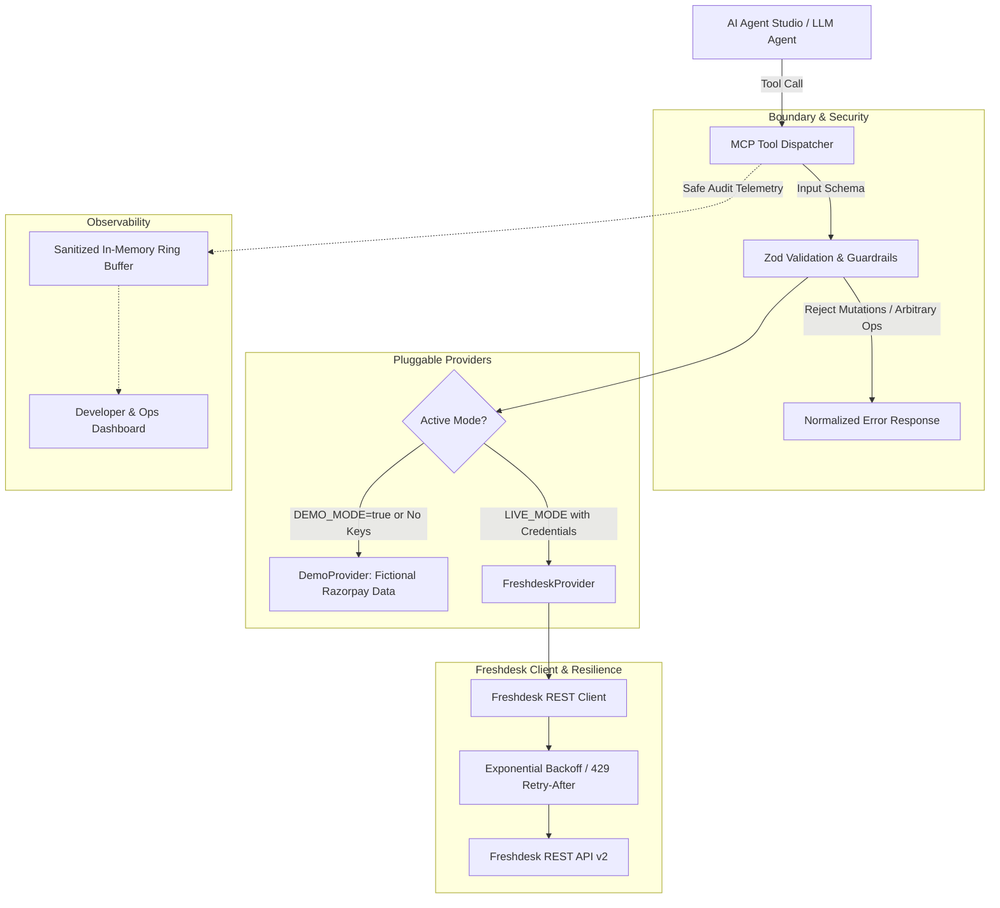

# Freshdesk Agent Connector

An enterprise-grade, Model Context Protocol (MCP) compatible connector designed for AI Agent Studio agents to securely inspect and summarize merchant support tickets from Freshdesk.

Built as a Forward-Deployed Engineer evaluation for Razorpay merchant support integration.

---

## What This Project Does

Merchant support operations at scale require AI agents to safely answer merchant questions, investigate billing disputes, and correlate payment gateway status without risking accidental modifications, credential exposure, or service disruption.

This connector provides:
1. **Agent Tool Layer (MCP-compatible)**: Exposes 5 strict read-only tool primitives (`list_tickets`, `get_ticket`, `search_tickets`, `list_ticket_conversations`, `get_ticket_summary`).
2. **Pluggable Provider Architecture**: Seamlessly toggles between a realistic local **DemoProvider** (featuring 10 complex Razorpay merchant dispute scenarios) and a live **FreshdeskProvider** (official REST API v2).
3. **Enterprise Security Guardrails**: Enforces runtime Zod validation, strict read-only access (blocking all mutations, deletions, or replies), and zero credential leakage.
4. **Resilience & Rate Limiting**: Production-minded HTTP 429 backoff handling with `Retry-After` parsing and bounded exponential retry loops.
5. **Deterministic Summarization**: Extracts root causes, customer sentiment, referenced payment IDs (e.g. `pay_*`, `sub_*`, `rfnd_*`), and suggested next steps without external LLM dependencies.
6. **Developer & Operations Dashboard**: Real-time observability dashboard for tracking tool calls, inspecting JSON schemas, testing payloads, and viewing latency metrics.

---

## Why This Architecture

### 1. Pluggable Provider Interface (`TicketProvider`)
By decoupling the MCP tool layer from the upstream transport, the connector avoids coupling agent contracts to Freshdesk API idiosyncrasies. The tools depend strictly on the `TicketProvider` contract. In development or offline environments, `DemoProvider` serves identical normalized responses as `FreshdeskProvider`.

### 2. Guardrails at the Boundary
AI Agents must never be granted raw HTTP forwarding capabilities or unbounded API keys. Every tool input is validated through strict Zod schemas with bounded integer pagination (`1 <= per_page <= 100`). Arbitrary endpoint execution is rejected at the routing layer.

### 3. Response Normalization
Freshdesk API v2 uses integer enums for status (e.g., `2` for open, `4` for resolved) and priority (`1` for low, `4` for urgent), along with unstructured HTML discussion bodies. The connector normalizes these into clean TypeScript interfaces and strips risky HTML markup before returning data to the agent.

---

## Architecture



---

## Available Tools

| Tool Name | Purpose | Access | Inputs |
| :--- | :--- | :---: | :--- |
| `list_tickets` | Retrieve paginated tickets with status & priority filtering | **Read-Only** | `page` (int, min 1), `per_page` (int, 1-100), `status` (string), `priority` (string) |
| `get_ticket` | Retrieve complete normalized metadata for a single ticket | **Read-Only** | `ticket_id` (int, required) |
| `search_tickets` | Search tickets by problem keywords, payment IDs, or requester | **Read-Only** | `query` (string, 1-200 chars), `page` (int), `per_page` (int) |
| `list_ticket_conversations` | Retrieve chronological thread of merchant queries and agent replies | **Read-Only** | `ticket_id` (int, required), `page` (int), `per_page` (int) |
| `get_ticket_summary` | Deterministically summarize root cause, sentiment, and next steps | **Read-Only** | `ticket_id` (int, required) |

---

## Setup & Running

### Requirements
- **Node.js**: v18.0.0 or higher
- **Package Manager**: npm or bun

### 1. Installation
```bash
npm install
```

### 2. Environment Configuration
The application comes pre-configured with a `.env.example`.
If credentials are absent, the application starts in **DEMO MODE** automatically.

```bash
cp .env.example .env
```

Environment variables:
```env
# Port
PORT=3000

# Connector Mode (defaults to true if Freshdesk credentials omitted)
DEMO_MODE=true

# Freshdesk REST API Credentials (when connecting to live instance)
FRESHDESK_DOMAIN=your-subdomain.freshdesk.com
FRESHDESK_API_KEY=your_freshdesk_api_key_here

# Network Resilience
REQUEST_TIMEOUT_MS=10000
MAX_RETRIES=3
```

### 3. Run the Development Server
```bash
npm run dev
```
Open [http://localhost:3000](http://localhost:3000) to access the Developer Dashboard.

### 4. Run the Automated Demo Script
```bash
npm run demo
```
This executes all 5 tools, demonstrates invalid input rejection, blocks an unauthorized mutation attempt, and runs a mocked 429 rate limit backoff sequence.

### 5. Run the Automated Test Suite
```bash
npm test
```
To run tests with coverage:
```bash
npm run test:coverage
```

---

## Rate Limiting & Resilience Strategy

Freshdesk accounts are subject to API rate limiting. When limits are exceeded, Freshdesk responds with `HTTP 429 Too Many Requests` accompanied by a `Retry-After` header in seconds.

The `FreshdeskClient` handles this through bounded exponential backoff:
1. **Attempt 1**: If HTTP 429 is encountered, parse the `Retry-After` response header. If missing, default to `2^attempt * 1000ms`.
2. **Attempt 2**: Apply exponential backoff with jitter, capped at a maximum 10-second sleep to prevent agent timeout.
3. **Attempt 3 (Final)**: If the upstream is still saturated, terminate the retry loop and return a structured `RATE_LIMITED` error:
   ```json
   {
     "error": {
       "code": "RATE_LIMITED",
       "message": "Freshdesk rate limit reached after 3 attempts.",
       "retryable": true,
       "retry_after_seconds": 60
     }
   }
   ```
4. **Server Transient Errors (500, 502, 503, 504)** are similarly retried with jitter before propagating.
5. **Client Errors (401, 403, 404)** fail immediately without wasteful retries.

---

## Security Guardrails

- **Zero Credentials in Client Code**: All Freshdesk API keys reside exclusively in server-side environment variables. No tokens or keys are exposed to Vite or the browser.
- **Strict Read-Only Enforcement**: Only GET queries are supported. Mutation methods (`POST`, `PUT`, `PATCH`, `DELETE`) are structurally impossible through the tool registry.
- **Whitelist Dispatcher**: The tool executor endpoint (`POST /api/tools/:toolName/execute`) validates the requested tool name against a closed dictionary of 5 registered tools.
- **Zod Schema Sanitization**: All inputs are checked against rigorous Zod schemas, preventing query injections and path traversals.
- **Credential Redaction in Logs**: The structured logger scrubs all parameters matching `(key|token|auth|secret|password|bearer|cookie|authorization)`.

---

## Agent Usage Examples

| User Intent | Invoked Tool Primitive | Sample Parameters |
| :--- | :--- | :--- |
| *"Show me recent open tickets."* | `list_tickets` | `{"status": "open", "page": 1, "per_page": 20}` |
| *"Find tickets discussing failed payments."* | `search_tickets` | `{"query": "payment failed", "per_page": 10}` |
| *"What is the status of ticket 1001?"* | `get_ticket` | `{"ticket_id": 1001}` |
| *"What did the merchant and support agent say?"* | `list_ticket_conversations` | `{"ticket_id": 1001}` |
| *"Give me an executive summary of ticket 1001."* | `get_ticket_summary` | `{"ticket_id": 1001}` |

---

## What the Agent CAN and CANNOT Do

### What the Agent CAN Do:
- List and filter support tickets
- Retrieve ticket details, custom fields, and tags
- Search tickets by keyword, customer name, or payment ID
- Retrieve multi-turn conversation threads between merchants and support agents
- Generate deterministic briefings with identified entity IDs and suggested next steps

### What the Agent CANNOT Do:
- Create new tickets
- Modify ticket status, priority, or custom fields
- Post public or private replies to merchants
- Delete tickets or customer records
- Modify customer billing, payment mandates, or settlements
- Execute arbitrary Freshdesk endpoints outside the 5 registered tools

---

## Known Limitations

1. **API Key Authentication**: Freshdesk supports API-key basic authentication natively for backend integrations. While OAuth 2.0 is supported for Freshworks marketplace apps, API-key authentication is the standard pattern for private internal service-to-service connectors.
2. **Rate Limit Ceiling**: Freshdesk rate limits vary by subscription tier (Forest, Estate, Blossom). High-frequency agent swarms will require a distributed Redis cache layer in front of Freshdesk.
3. **Deterministic Summarization**: The default summarizer relies on deterministic entity extraction and conversation analysis. While completely free of LLM cost and external API failure, complex sentiment nuances benefit from an optional LLM pipeline.
4. **Search Syntax**: Freshdesk REST API search syntax (`/api/v2/search/tickets`) requires double-quoted phrases for compound queries.

---

## Long-Term Production Improvements

1. **Distributed Rate Limiting & Queue**: Introduce a Redis-backed token bucket to throttle concurrent agent requests across multiple server replicas before hitting Freshdesk.
2. **Response Caching**: Cache ticket metadata and closed conversation threads in Redis with short TTLs (e.g. 60s for open tickets, 24h for closed tickets) to reduce API consumption by 70%.
3. **Enterprise Secrets Management**: Migrate API keys from `.env` to AWS Secrets Manager, HashiCorp Vault, or Google Cloud Secret Manager with automated key rotation.
4. **OpenTelemetry Tracing**: Export trace spans (W3C TraceContext) across the Agent Studio invocation, MCP connector, and Freshdesk API.
5. **Human-in-the-Loop Write Workflows**: If write operations (e.g., posting an internal note) are added in the future, enforce two-party approval workflows before dispatch.
